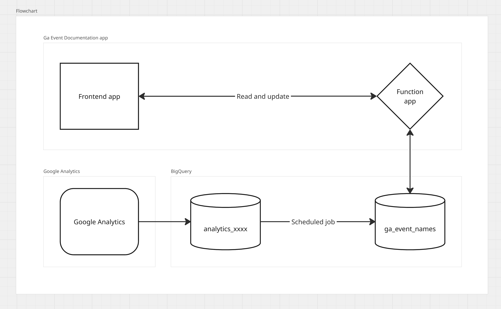

# Google Analytics Event Documentation Framework

## Overview

This framework provides a comprehensive solution for documenting Google Analytics events. It is primarily designed for developers to gain an overview of existing events and their structure. The documentation system offers a searchable, filterable interface that makes it easy to understand and manage analytics events across the organization.

## Features

- **Event Documentation**: Includes essential information for each event:
  - Event name
  - Event type (server-side/client-side)
  - Description
  - JSON format structure
  - Tags for categorization

- **Interactive Interface**:
  - Search functionality for finding specific events
  - Filter events by tags
  - Overview dashboard showing documented vs. undocumented events
  - Add new tags as needed
  - Update documentation directly from the interface

## Getting Started

This section provides step-by-step instructions to set up and run the Google Analytics Event Documentation Framework.

### Prerequisites

- .NET 8.0 SDK or later
- Node.js 18.x or later
- Google Cloud Platform account with BigQuery access
- Azure account (if deploying to Azure Functions)

### Setup Instructions

1. **BigQuery Configuration**
   - Use the provided setup script to create the required BigQuery resources:
     ```bash
     # Option 1: Using BigQuery Console
     # 1. Navigate to the BigQuery Console in Google Cloud Platform
     # 2. Copy and paste the contents of setup/bigquery_setup.sql
     # 3. Replace any project-specific references as needed
     # 4. Click "Run" (Note: requires GoogleSQL mode)
     
     # Option 2: Using bq command-line tool
     bq query --nouse_legacy_sql < setup/bigquery_setup.sql
     ```
   - The script will:
     - Create a dataset named `ga_event_names` in the EU region
     - Create a table named `event_names` with the required schema:
       ```
       event_name: STRING
       description: STRING
       format: JSON
       type: STRING (client/server)
       tags: JSON
       ```
     - Add appropriate descriptions to the table and columns
   - After running the setup script, set up a service account with appropriate permissions to access this table
   - Download the service account JSON key file

2. **BigQuery Integration**
   - Use the provided script to set up a scheduled query that automatically identifies new events:
     ```bash
     # Using BigQuery Console
     # 1. Navigate to the BigQuery Console in Google Cloud Platform
     # 2. Copy and paste the contents of setup/bigquery_scheduled_job_setup.sql
     # 3. Replace the placeholders:
     #    - YOUR_PROJECT_ID with your actual Google Cloud project ID
     #    - analytics_XXXXXX with your actual Google Analytics dataset ID
     # 4. Click "Run" (Note: requires GoogleSQL mode)
     ```
   - The script will:
     - Create a scheduled query that runs monthly (on the 1st day of each month)
     - Identify events from the last 30 days that aren't in your documentation table
     - Add these new events to the documentation table with default values
     - Tag them with "needs_review" for easy identification
   - You can customize the schedule in the script (daily, weekly, etc.) based on your needs
   - The original query is available in `setup/bigquery_job.sql` if you prefer to set up the scheduled job manually

3. **Local Development Setup**
   - Clone this repository
   - Add your service account JSON key to the project root or a secure location
   - Update `local.settings.json` with the following configuration:
     ```json
     {
       "IsEncrypted": false,
       "Values": {
         "AzureWebJobsStorage": "UseDevelopmentStorage=true",
         "FUNCTIONS_WORKER_RUNTIME": "dotnet-isolated",
         "GoogleServiceAccount": "<Your service account JSON>",
         "BigQuery:ProjectId": "<Your GCP project ID>",
         "BigQuery:DatasetId": "<Your BigQuery dataset ID>",
         "BigQuery:TableId": "<Your BigQuery table ID>"
       }
     }
     ```

4. **Run the Application Locally**
   - Build and run the .NET Function App:
     ```
     cd Projects/Komplett.Ga.EventDocumentation
     dotnet build
     dotnet run
     ```
   - Start the web application:
     ```
     cd Projects/Komplett.Ga.EventDocumentation/webapp
     npm install
     npm run dev
     ```
   - Access the web application at http://localhost:5173

5. **Deployment**
   - **.NET Function App**: Deploy to your preferred hosting service (Azure Functions, AWS Lambda, etc.)
   - **Web Application**: 
     - Build the web application: `npm run build`
     - Deploy the contents of the `dist` folder to a blob container or web hosting service
     - Configure CORS settings in your Function App to allow requests from your web application domain

6. **Verify Installation**
   - Access your deployed web application
   - Ensure it can connect to the Function App API
   - Verify that events are being displayed correctly

### Troubleshooting

- If you encounter CORS issues, check that your Function App has the correct CORS settings
- For BigQuery connection problems, verify your service account permissions and key
- If events aren't appearing, check the BigQuery scheduled query to ensure it's running correctly
- **BigQuery SQL Scripts**: 
  - The provided SQL scripts require GoogleSQL mode (not Legacy SQL)
  - If you encounter syntax errors when running the scripts, make sure "Use Legacy SQL" is unchecked in the BigQuery Console:
    1. Click on "More" and select "Query settings"
    2. Ensure "Use Legacy SQL" is unchecked
    3. Click "Save"
  - Alternatively, use the `--nouse_legacy_sql` flag with the bq command-line tool

## System Architecture

The system operates through the following components:

1. **BigQuery Integration**: Scheduled jobs run monthly to identify and extract new events
2. **.NET Function App**: Serves as the backend/API for retrieving and updating the BigQuery table
3. **Web Application**: Provides the user interface for viewing and managing event documentation

## System Flow



The diagram above illustrates the data flow within the system:
1. Events are collected in BigQuery from various sources
2. A scheduled job identifies new events and adds them to a dedicated documentation table
3. The .NET Function App provides API access to this data
4. The web application interfaces with the API to display and update documentation

## Usage

[Include basic usage instructions here]

## Contributing

Contributions are welcome! Here's how you can help:

1. **Fork the repository**
2. **Create a feature branch** (`git checkout -b feature/amazing-feature`)
3. **Commit your changes** (`git commit -m 'Add some amazing feature'`)
4. **Push to the branch** (`git push origin feature/amazing-feature`)
5. **Open a Pull Request**

Please make sure to update tests as appropriate and adhere to the existing coding style.

## License

MIT License

Copyright (c) 2025 Komplett

Permission is hereby granted, free of charge, to any person obtaining a copy
of this software and associated documentation files (the "Software"), to deal
in the Software without restriction, including without limitation the rights
to use, copy, modify, merge, publish, distribute, sublicense, and/or sell
copies of the Software, and to permit persons to whom the Software is
furnished to do so, subject to the following conditions:

The above copyright notice and this permission notice shall be included in all
copies or substantial portions of the Software.

THE SOFTWARE IS PROVIDED "AS IS", WITHOUT WARRANTY OF ANY KIND, EXPRESS OR
IMPLIED, INCLUDING BUT NOT LIMITED TO THE WARRANTIES OF MERCHANTABILITY,
FITNESS FOR A PARTICULAR PURPOSE AND NONINFRINGEMENT. IN NO EVENT SHALL THE
AUTHORS OR COPYRIGHT HOLDERS BE LIABLE FOR ANY CLAIM, DAMAGES OR OTHER
LIABILITY, WHETHER IN AN ACTION OF CONTRACT, TORT OR OTHERWISE, ARISING FROM,
OUT OF OR IN CONNECTION WITH THE SOFTWARE OR THE USE OR OTHER DEALINGS IN THE
SOFTWARE.